<div align="center">

<p>
  
  &nbsp;&nbsp;&nbsp;&nbsp;&nbsp;&nbsp;
  
</p>

# ARINC 615A Target for VxWorks 24.03

**The target side of the ARINC 615A Data Loading Protocol, as a VxWorks Downloadable Kernel Module**
Answers FIND, reports part numbers, accepts software uploads and serves downloads over Ethernet.

[](#setup--build-the-dkm-in-workbench)
[](#setup--build-the-dkm-in-workbench)
[](https://en.cppreference.com/w/cpp/17)
[](#office-image-compatibility)
[](third_party/DEPENDENCIES.md)

[](#office-image-compatibility)
[](#layer-1--host-build-and-offline-verification)
[](#test-results)
[](#layer-5--data-loader-cli-acceptance)
[](LICENSE)
[](#protocol-background)

[](https://github.com/Hitheshkaranth/arinc-615a-cli-tool-suite)
[](https://github.com/Hitheshkaranth/arinc-615a-gui-tool-suite)

</div>

---

## What this is

ARINC 615A is how aircraft software gets onto, and off, the boxes on board. A
ground **data loader** talks over Ethernet to a **target**, the LRU being loaded.
The [ARINC 615A CLI Tool Suite](https://github.com/Hitheshkaranth/arinc-615a-cli-tool-suite)
is the loader. **This repository is the other end: the target.**

It builds the ARINC 615A **Target Hardware Application (THA)** as a VxWorks 24.03
**Downloadable Kernel Module (DKM)** for the office board: NXP Layerscape
(LS1028A), Cortex-A72, LLVM. Once loaded, the board:

- **answers FIND** so data loaders can discover it on the network,
- **reports its hardware and part numbers** (Information operation, `LCL`),
- **accepts uploads** of ARINC 665 loads, checking length and CRC before storing them,
- **serves downloads**, both media-defined and operator-defined,
- **rejects bad input** such as malformed packets, empty headers, path traversal and corrupt data, and keeps serving.

Everything needed to build it is in the repository, including Boost. There are
no downloads, no sibling repositories and no Git at build time. A ready-made
Workbench handoff lives in
[`delivery/ARINC615A_OFFICE_READY.zip`](delivery/ARINC615A_OFFICE_READY.zip).

> [!IMPORTANT]
> **Validation status.** Everything below the board has been proven: host builds,
> 229 regression cases, a VxWorks-configured compile of every source file, an audit
> of the office kernel image, and end-to-end runs against the real data loader CLI.
> **The Workbench build and the run on the physical board still have to be
> done in the office**, because the licensed SDK and the board are not available
> off-site. [`VXWORKS_TEST_PROCEDURE.md`](workbench/VXWORKS_TEST_PROCEDURE.md)
> is the checklist that closes that gap. See [VALIDATION.md](VALIDATION.md).

---

## Quick start — one command

From nothing to a built, fully checked target, in one line:

**Linux** (installs any missing tools; verified on Ubuntu, Debian, Fedora, Arch
and openSUSE)

```bash
git clone https://github.com/Hitheshkaranth/VxWorks_Arinc_615A_target_Code.git && cd VxWorks_Arinc_615A_target_Code && ./setup.sh
```

**Windows** (`cmd`; builds through WSL, then run `wsl --install` once if WSL is missing)

```bat
git clone https://github.com/Hitheshkaranth/VxWorks_Arinc_615A_target_Code.git && cd VxWorks_Arinc_615A_target_Code && setup.bat
```

That builds everything offline and runs the 229-case regression suite, the
VxWorks preflight (129/129 files) and the dependency audit. It takes about four
minutes the first time.

| Platform | Status of the one-liner |
| --- | --- |
| Ubuntu 24.04 · Ubuntu 22.04 · Fedora 41 | ✅ verified from bare Docker images. On 22.04 it also fetched CMake 3.31.6 |
| Debian 12 · Arch · openSUSE Tumbleweed | ✅ verified from bare Docker images, cloning from GitHub (GCC 12 to 16, CMake 3.25 to 4.4) |
| WSL Ubuntu · Windows 11 (`setup.bat`) | ✅ verified |

On every Linux image, verified means the tools installed, the build succeeded, all
checks passed and the rehearsal ran 9/9 (target, protocol peer, upload check,
clean stop).

### One-line usage

| What | Linux | Windows |
| --- | --- | --- |
| Build and run all host checks | `./setup.sh` | `setup.bat` |
| Rehearse: local target + protocol peer + upload check | `./setup.sh rehearse` | `setup.bat rehearse` |
| Run the target on this PC (Enter stops it) | `./setup.sh run` | `setup.bat run` |
| Test a running target, e.g. the board | `./setup.sh test 192.168.0.3` | `setup.bat test 192.168.0.3` |
| Test it with the ARINC 615A CLI Tool Suite | — | `setup.bat cli 192.168.0.3 <cli-build>` |
| Help | `./setup.sh help` | `setup.bat help` |

`run` prints the exact `test` and `cli` commands for the target it started. As a
normal user it moves the ports to 11001/10059, because Linux reserves ports below
1024 for root. Add `--find-port 11001 --tftp-port 10059` to `test`, and
`-FindPort 11001 -TftpPort 10059` to `cli`. On Windows, `test` and `cli` run natively
(Python and PowerShell) so the board's TFTP transfers reach them; only the
build goes through WSL.

Then take `delivery/ARINC615A_OFFICE_READY.zip` to Workbench, see
[Setup — build the DKM in Workbench](#setup--build-the-dkm-in-workbench).

---

## ARINC 615A in brief

ARINC 615A-4 (*Software Data Loader Using Ethernet Interface*) defines how a
**data loader** (DL) moves software and data to and from **target hardware** over
Ethernet. It has two parts:

- **FIND** (*FIND Identification of Network Devices*): a UDP broadcast on port
  **1001**. The loader asks "who is out there?" (IRQ), and every target answers
  with its identity (IAN): hardware ID, type, position, name and manufacturer.
- **The Data Load Protocol (DLP)**: every operation is a series of small
  **protocol files** exchanged over **TFTP** on UDP port **59**. There are no
  commands and no sessions, only files whose extension says what they mean.

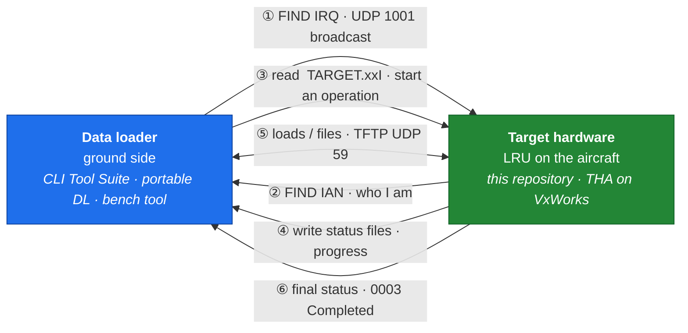

### The four operations

| Operation | Starts with | What it does | Typical use |
| --- | --- | --- | --- |
| **Information** | `<ID>.LCI` | Target sends its configuration list `LCL`: hardware, serial number, part numbers | Confirm what software is installed before or after a load |
| **Upload** | `<ID>.LUI` | Loader sends a list of loads (`LUR`); the target pulls each ARINC 665 load header (`.LUH`) and its files | Install new software or data on the LRU |
| **Media Defined Download** | `<ID>.LND` | Loader names the files it wants (`LNR`); the target sends them | Retrieve known files such as logs or configuration |
| **Operator Defined Download** | `<ID>.LNO` | Target offers a list (`LNL`), the operator picks from it (`LNA`), the target sends them | Browse and retrieve whatever the target offers |

`<ID>` is the **target ID** (`ARINC_1` here). Status files (`LUS`, `LNS`) carry a
counter, a progress ratio, an exception timer and one of these codes:

| Code | Meaning | | Code | Meaning |
| --- | --- | --- | --- | --- |
| `0001` | Operation accepted | | `1000` | Operation denied |
| `0002` | In progress | | `1002` | Not supported by the target |
| `0003` | **Completed** | | `1003` | Aborted by the target hardware |
| `0004` | In progress, with description | | `1004` / `1005` | Aborted by the data loader / the operator |

**Software loads** travel as **ARINC 665** media sets: a load header (`.LUH`)
lists the load's part number, the target hardware it is for, and every data file
with its length and CRC. The target uses that header to check what it received.

---

## How it fits together

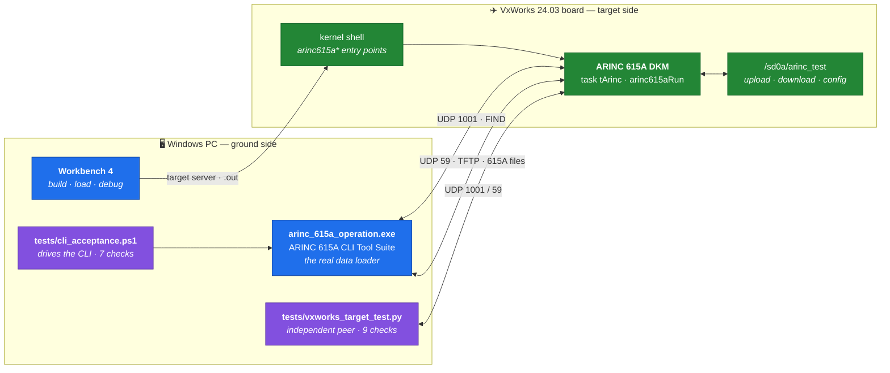

The loader starts every conversation. The target listens on **UDP 1001** (FIND)
and **UDP 59** (data load, not the usual TFTP port 69), then opens TFTP transfers
back to the loader for status and data files. Every operation is a set of
**files** moved over TFTP; only FIND is a plain request and answer.

### Inside the module

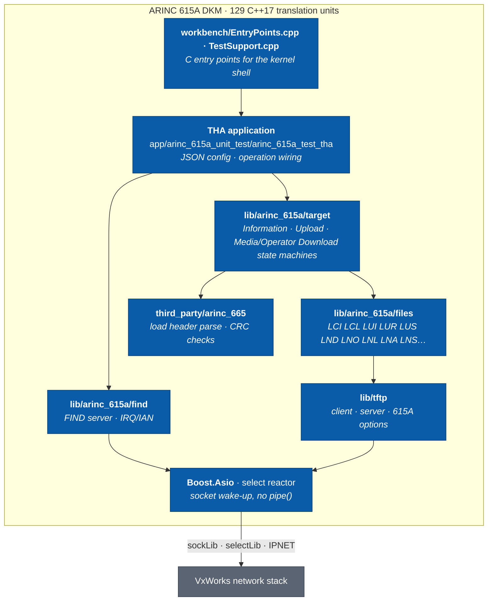

---

## Architecture in detail

The diagrams below follow the code: `app/arinc_615a_unit_test/arinc_615a_test_tha/arinc_615a_test_tha.cpp`
(runtime and dispatch), `TargetUploadOperation.cpp` (upload checks),
`lib/arinc_support/BuildConfig.hpp` (VxWorks adaptation) and `tools/prepare_office.py`
(packaging). The ground side in every diagram is the
**[ARINC 615A CLI Tool Suite](https://github.com/Hitheshkaranth/arinc-615a-cli-tool-suite)**
(`arinc_615a_operation.exe`), the data loader used to test this target.

### 1 · Task and event-loop model

The module creates **no threads of its own**. `arinc615aRun` builds one
`boost::asio::io_context`, registers the FIND server and the ARINC 615A target
protocol on it, and runs it **inside the calling task**, `tArinc`. Every
callback, timer and TFTP transfer runs one at a time on that task, so the
protocol code needs no locks. Stopping is a message into the event loop, not a
kill.

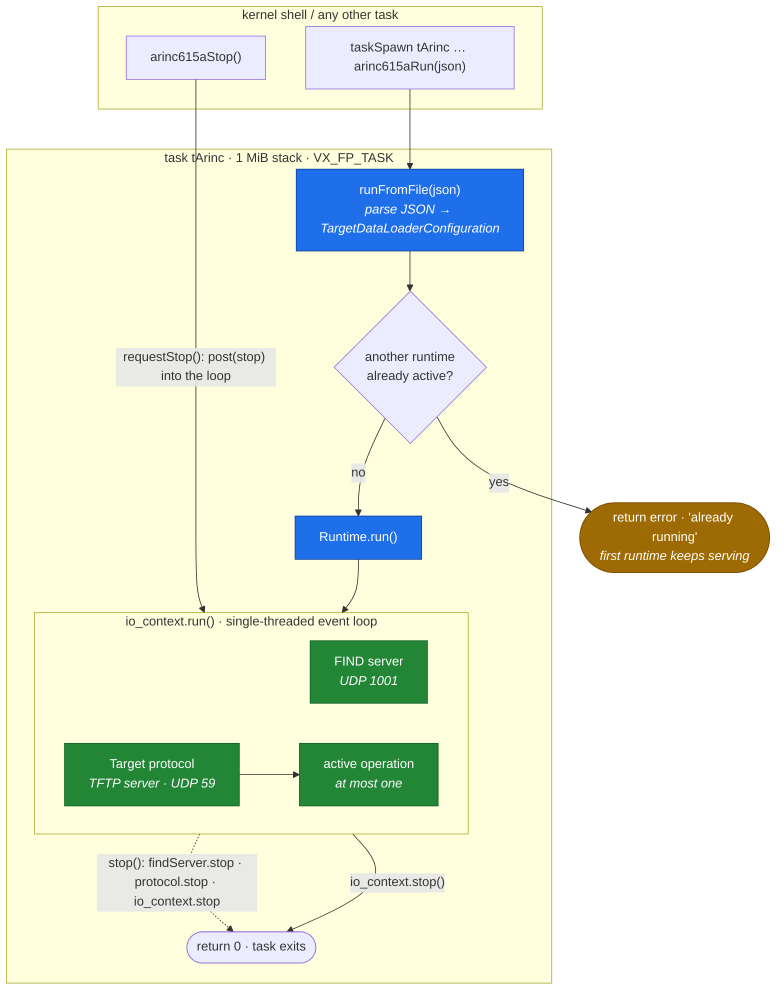

**Why this matters on VxWorks.** One task means one stack to size (`checkStack`),
and nothing is left running after `arinc615aRun` returns, so `unld` is safe once
`tArinc` has gone. `arinc615aStop` is safe to call from any task: it only posts
a message, and the stop itself runs inside `tArinc`.

### 2 · Request dispatch

Every data-load request, whichever operation it is, arrives as a TFTP read of an
initialisation file (`<TARGET_ID>.LCI`, `.LUI`, `.LND` or `.LNO`) and goes
through one gate, `Runtime::operationRequest`. A request that fails the gate
still gets a proper ARINC 615A answer: an **error operation** that returns
*Operation Denied* or *Not Supported* instead of silence.

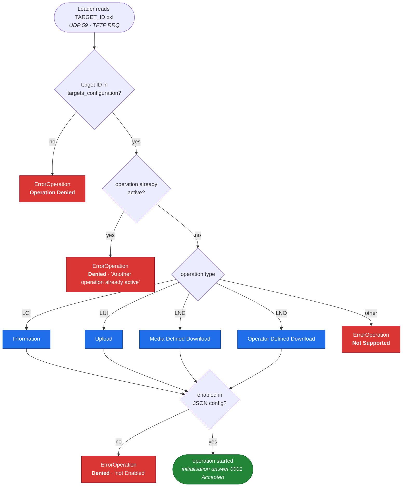

### 3 · Protocol file exchange per operation

ARINC 615A is file-driven. The loader starts each operation by *reading* an
initialisation file from the target. After that, the **target** pushes status
files to the loader, and whichever side owns the data sends it. `(P)` marks the
files that use the port the loader advertised with `--port-option`.

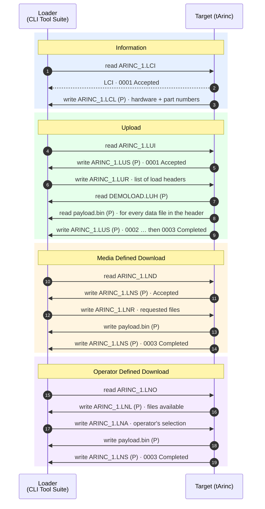

| Operation | Init file (loader reads) | Loader writes | Target writes | Final status |
| --- | --- | --- | --- | --- |
| Information | `LCI` | — | `LCL` | Completed with the `LCL` |
| Upload | `LUI` | `LUR`, then serves `.LUH` + data files | `LUS` (repeated) | `LUS` 0003 |
| Media Defined Download | `LND` | `LNR` | `LNS`, requested files | `LNS` 0003 |
| Operator Defined Download | `LNO` | `LNA` | `LNL`, `LNS`, selected files | `LNS` 0003 |

Download sources come from the configured download directory; uploads land in
the configured upload directory. Both are set per target in the JSON config.

### 4 · Upload validation pipeline

An upload is only accepted if **the bytes stored on the target's disk** match
what the load header promises. The check runs on the stored file, not on the
data received over the network, so a filesystem write error is caught too.

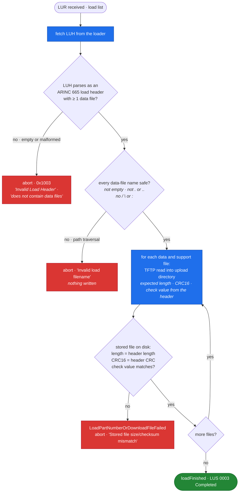

Each rejection branch is exercised by a test: T07 (empty, malformed and
path-traversal headers) and T08 (corrupt and truncated payloads) in
[`vxworks_target_test.py`](tests/vxworks_target_test.py), and `arinc615aVerifyTestUpload`
confirms afterwards that no `escape.bin` ever reached the disk.

### 5 · VxWorks adaptation layer

Almost all of the code is plain, portable C++17. Everything VxWorks-specific is
concentrated in one force-included header and one Boost overlay, so the
protocol code never tests for the platform.

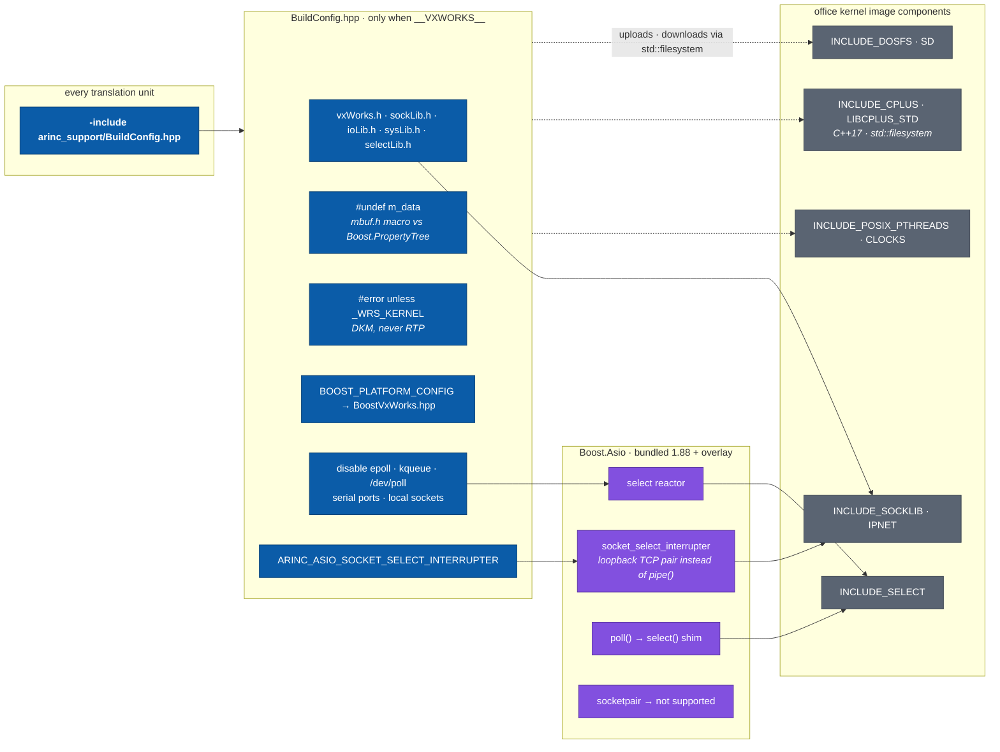

The preflight ([layer 2](#layer-2--vxworks-preflight)) checks this layer on
every build. It asserts the select reactor, the socket interrupter and the
`selectLib.h` include chain, and its stub `sockLib.h` defines `m_data`, so a
missing `#undef` fails the check.

### 6 · Build and delivery pipeline

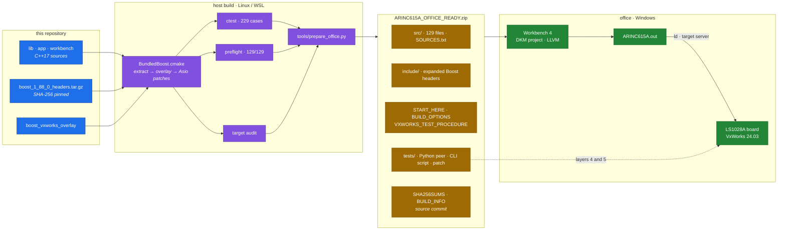

The office machine needs no Python, CMake, Git or internet: the ZIP carries
expanded headers and an explicit source list. `BUILD_INFO.txt` records the
source commit, and `SHA256SUMS.txt` lets the office check that nothing changed in
transit.

---

## Shell entry points

The module exports plain C functions, so everything is driven from the VxWorks
kernel shell (C interpreter) or from a Workbench debug launch.

| Function | Returns | Purpose |
| --- | --- | --- |
| `arinc615aSelfTest()` | `0` = pass | Codec and SHA-256 self-test. No network or storage needed |
| `arinc615aDemo()` | on stop | FIND + Information demo with built-in defaults; **blocks** its task |
| `arinc615aRun(const char *json)` | on stop | Full target from a JSON config; **blocks** its task |
| `arinc615aStop()` | `1` = queued | Ask a running `arinc615aRun`/`arinc615aDemo` to stop (call from another task) |
| `arinc615aPrepareTest(const char *root)` | `0` = ok | Create `root/upload`, `root/download` fixtures and `root/test-config.json` |
| `arinc615aVerifyTestUpload(const char *root)` | `0` = pass | Check the uploaded `payload.bin` is byte-identical and nothing escaped the upload folder |
| `arinc615aWriteFixtures(const char *dir)` | `0` = ok | Write only the four test fixtures into `dir` |

Defaults used by the demo and the test config: **FIND port 1001**, **TFTP port 59**,
**target ID `ARINC_1`**, hardware ID `ARINC`, part number `DEMO-PN`, serial `TEST001`.

---

## Office image compatibility

The code was audited against the office's exported projects
(`UVDR_VIP_20260218`, `UVDR_VSB_20260218`, BSP `nxp_layerscape_a72_2_0_7_4`, LLVM,
`CORTEX_A72`). Every C and POSIX function the module calls was looked up in the
VSB library symbol tables, and every owning component was checked in the kernel
image. The gaps this found are fixed in the code, so the module works on the
**image as it is**, with no kernel rebuild:

| The image lacks | Would have caused | Fix in this repository |
| --- | --- | --- |
| `INCLUDE_POSIX_PIPES` → no `pipe()` | Unresolved `pipe` at `ld`; the module never loads | Boost.Asio uses its loopback-socket wake-up (`ARINC_ASIO_SOCKET_SELECT_INTERRUPTER`, set in `BuildConfig.hpp`) |
| `pthread_rwlock_*` (not in the VSB) | Unresolved at load or compile | Statistics classes use `std::mutex` instead of `std::shared_mutex` |
| `poll()` (not linked into the image) | Unresolved `poll` | `poll()` shim over `select()` in the bundled Asio overlay |
| `socketpair()` (not declared) | Compile error | Asio's `socketpair` reports unsupported, as on Windows (local sockets are disabled) |
| `m_data` macro from `mbuf.h` | Boost.PropertyTree compile errors | `#undef m_data` in `BuildConfig.hpp` right after the VxWorks headers |
| A RAM disk (`/ram0` does not exist) | Upload/download paths fail | Configs and tests use the SD card: `/sd0a/...` |

Present and used: C++ with exceptions and RTTI, the Dinkumware C++17 library
including `std::filesystem`, pthreads, clocks, `select`, IPv4 sockets, DOSFS on
SD, loader and unloader, `memShow` and `checkStack`.

The Boost fixes live in [`third_party/boost_vxworks_overlay`](third_party/boost_vxworks_overlay)
and are applied by [`cmake/BundledBoost.cmake`](cmake/BundledBoost.cmake), so a
regenerated package always carries them.

---

## Setup — build the DKM in Workbench

### Prerequisites

| | Needed |
| --- | --- |
| Host | Windows PC with **Wind River Workbench 4** and the office **VxWorks 24.03 SDK** |
| Target image | The office VIP/VSB (or any image with the components above) running on the board |
| Network | PC and board on the same IPv4 subnet; UDP **59** and **1001** open |
| Storage | A writable DOSFS partition on the board, e.g. `/sd0a` |
| For testing | Python 3.8+ and the [ARINC 615A CLI Tool Suite](https://github.com/Hitheshkaranth/arinc-615a-cli-tool-suite) |

### Steps


1. **Extract** `delivery/ARINC615A_OFFICE_READY.zip` to a short local path.
2. In Workbench, create a **VxWorks Downloadable Kernel Module** project (not RTP)
   on platform **vxworks/24.03** with **CORTEX_A72 / ARM64** and **LLVM 17.0.6.1**.
   Use the **same VSB and BSP as the running board image**. Remove any
   wizard-generated sample source.
3. **Build options.** Copy them from `BUILD_OPTIONS.txt`:

   ```text
   -std=c++17  -g  -O0  -fexceptions  -frtti  -include arinc_support/BuildConfig.hpp

   Include directories:  include   src/lib   src/workbench
                         src/app/arinc_615a_unit_test/arinc_615a_test_tha
   ```

4. **Build input.** Compile only `src/`. Exclude `include/`, `tests/` and the
   top-level `workbench/`. `SOURCES.txt` in the package is the exact list of
   129 files.
5. **Build Debug.** Keep the first build log word for word if anything fails;
   `START_HERE.md` §6 lists the likely first-build errors and their fixes.

> [!WARNING]
> Build with `-std=c++17`, **not** C++20. The 24.03 LLVM 17 runtime does not
> provide the C++20 library features, and the code deliberately avoids them.

Full walkthrough: [`workbench/START_HERE.md`](workbench/START_HERE.md).

---

## Runtime — load and run on the board

Type these in the kernel shell, at the `->` prompt.

### 1. Load and self-test

```c
-> ld < /tgtsvr/<path-below-tgtsvr-root>/ARINC615A.out   /* or Workbench: Download */
-> lkup "arinc615a"                                      /* 7 entry points listed */
-> arinc615aSelfTest
ARINC self-test PASS (codecs and SHA256; network/storage tested separately)
value = 0 = 0x0
```

The load must report **no unresolved symbols**.

### 2. Prepare the test root and start the target

```c
-> devs                                   /* confirm /sd0a is mounted */
-> arinc615aPrepareTest "/sd0a/arinc_test"
ARINC test prepared. Start the loader with config /sd0a/arinc_test/test-config.json
-> taskSpawn("tArinc", 100, 0x01000000, 0x100000, arinc615aRun, "/sd0a/arinc_test/test-config.json")
-> i                                      /* tArinc is PEND, waiting on the network */
```

`0x01000000` is `VX_FP_TASK`, and `0x100000` gives the task a 1 MiB stack.
`arinc615aRun` blocks, so it always runs in its own task.

### 3. Stop, restart, unload

```c
-> arinc615aStop                          /* returns 1 = stop queued */
-> i                                      /* tArinc has exited */
-> unld "ARINC615A.out"                   /* never while tArinc exists */
```

### Lifecycle

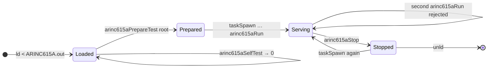

### Configuration

`arinc615aRun` reads a JSON file. The sample [`target-config.json`](workbench/target-config.json)
enables every operation:

```json
{
  "version": "Arinc615a34",
  "arinc_615a":      { "local_tftp_address": "0.0.0.0", "tftp": { "port": 59, "timeout": 3, "retries": 3 } },
  "arinc_615a_find": { "local_find_address": "0.0.0.0", "find_port": 1001 },
  "targets_configuration": [{
    "target_id": "ARINC_1",
    "information_operation":               { "enabled": true, "...": "hardware + part numbers" },
    "upload_operation":                    { "enabled": true, "directory": "/sd0a/ARINC/upload" },
    "media_defined_download_operation":    { "enabled": true, "directories": { "directory": "/sd0a/ARINC/download" } },
    "operator_defined_download_operation": { "enabled": true, "directories": { "directory": "/sd0a/ARINC/download" } }
  }]
}
```

Replace the demo part numbers with real hardware data, and point the
directories at **target** paths, not Windows paths.

---

## Connecting a real target to the CLI tool

This section connects the board running this module to the
**[ARINC 615A CLI Tool Suite](https://github.com/Hitheshkaranth/arinc-615a-cli-tool-suite)**
on a Windows PC. The addresses and interfaces are those of the office image
(`UVDR_VIP_20260218`). Its default boot line is
`memac(0,0)host:vxWorks h=192.168.0.2 e=192.168.0.3`.

### Physical setup

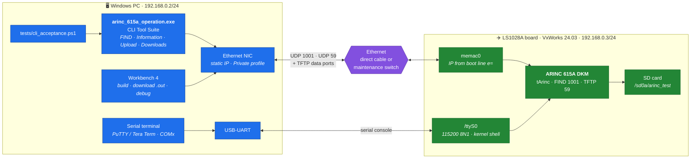

Two links, two jobs:

- **Ethernet** carries ARINC 615A: FIND on UDP 1001, the data load on UDP 59, and
  the TFTP transfers the board opens back to the PC. Workbench uses it too.
- **Serial** is the kernel shell, used to load, start and check the module. The
  image has **no telnet server**, so the console is the shell.

### Address plan

| | PC | Board |
| --- | --- | --- |
| IPv4 | `192.168.0.2/24` (boot-line host `h=`) | `192.168.0.3/24` (boot-line target `e=`) |
| Interface | the PC's Ethernet NIC | `memac0` |
| Listens on | TFTP data ports opened by the CLI | UDP **1001** (FIND), UDP **59** (TFTP) |
| Console | COM port · 115200 8N1 | `/ttyS0` |

> [!NOTE]
> The board's IP comes from its **boot line**, not from the shell. The image does
> not include the `ifconfig` shell command. To use another address, change `e=` in
> the boot parameters and reboot, or rebuild the VIP with a new `DEFAULT_BOOT_LINE`.
> Keep the PC and the board in the same subnet: FIND is a broadcast and does not
> cross routers.

### Bring-up, step by step

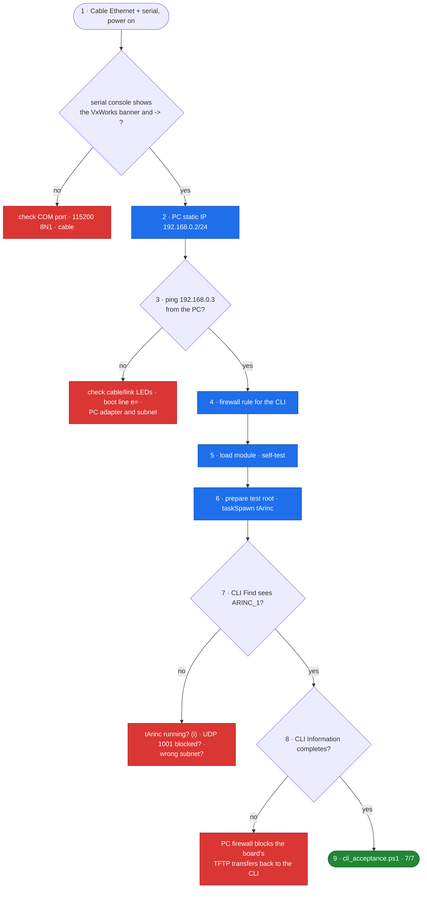

**1 · Cable and console.** Connect the board's Ethernet port to the PC (direct or
through a switch) and the board's console UART to the PC. Open the COM port at
**115200 8N1** and power on. You should see the VxWorks banner and the `->`
prompt.

**2 · Give the PC its address.** In an elevated `cmd`, using the adapter name
shown by `ipconfig`:

```bat
netsh interface ipv4 set address name="Ethernet" static 192.168.0.2 255.255.255.0
```

**3 · Check the link.** There is no `ping` command on the board, so check from
the PC:

```bat
ping 192.168.0.3
```

**4 · Let the board's transfers reach the CLI.** The board opens TFTP transfers
*to* the PC, so Windows Firewall must allow them. Run once, elevated:

```bat
netsh advfirewall firewall add rule name="ARINC615A loader CLI (UDP in)" dir=in action=allow protocol=UDP profile=private remoteip=192.168.0.0/24 program="<cli-build>\app\arinc_615a_operation\arinc_615a_operation.exe"
```

**5–6 · Load and start the target.** In the serial console:

```c
-> ld < /tgtsvr/<path>/ARINC615A.out      /* or Workbench: Download */
-> arinc615aSelfTest                      /* value = 0 */
-> arinc615aPrepareTest "/sd0a/arinc_test"
-> taskSpawn("tArinc", 100, 0x01000000, 0x100000, arinc615aRun, "/sd0a/arinc_test/test-config.json")
-> i                                      /* tArinc is PEND */
```

**7–8 · Talk to it with the CLI.** On the PC, with the CLI's DLLs on `PATH`:

```bat
arinc_615a_operation.exe -c Find
arinc_615a_operation.exe -c Find        --target-address=192.168.0.3
arinc_615a_operation.exe -c Information --target-address=192.168.0.3 --target-id=ARINC_1 --port-option
```

The first `Find` is a broadcast and should discover the board without being
told its address. `Information` should end with
`Final Status Code: Operation completed (0003)`.

**9 · Full acceptance.**

```bat
powershell -ExecutionPolicy Bypass -File tests\cli_acceptance.ps1 -Target 192.168.0.3 -CliBuild <cli-build>
```

```c
-> arinc615aVerifyTestUpload "/sd0a/arinc_test"
```

### A complete CLI session with the board

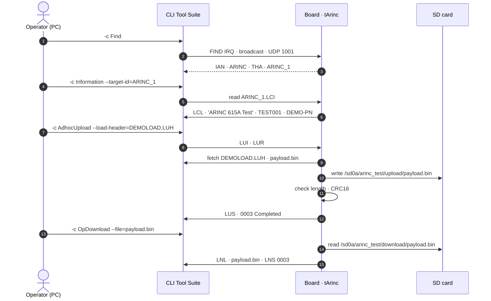

### Within the system

There are two ways to run the target and the CLI together without a
separate test bench.

#### On one PC, with no board

The same target code builds as `arinc_host_runner`. Run it in WSL, and the
Windows CLI talks to it across the virtual network, exactly as it would to the
board. This is how the [CLI test run](#how-it-was-actually-tested-and-the-result)
was done.

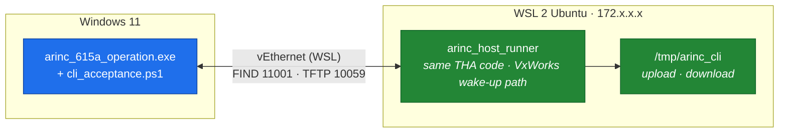

Ports move to 11001 and 10059 because Linux reserves ports below 1024 for root.
The commands are in [Rehearse without a board](#rehearse-without-a-board).

#### Inside the UVDR system on the board

In service, the ARINC 615A target runs **next to the UVDR application** on the
same VxWorks image. It shares the network interface and the SD card, but has its
own task, ports and folders.

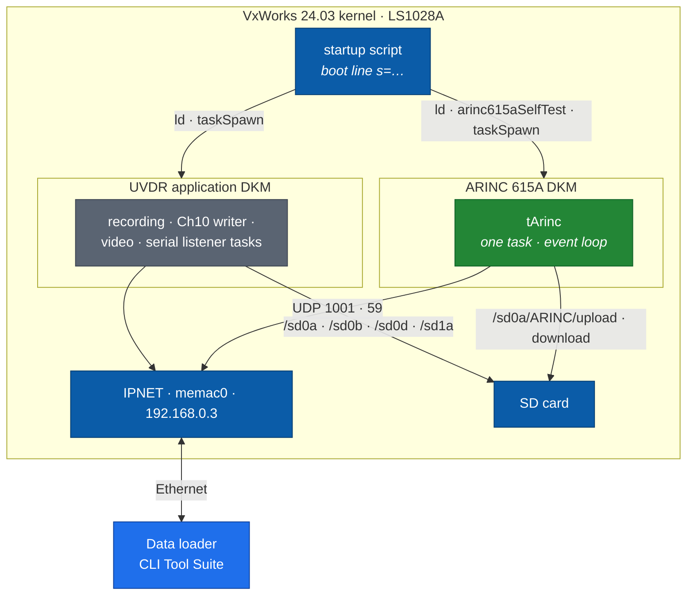

To start it automatically at boot, the image already includes
`INCLUDE_STARTUP_SCRIPT`. Put a shell script on the SD card and set the boot
line's startup-script field (`s=`) to it:

```c
/* /sd0a/startup.cmd, run by the kernel shell at boot */
ld < /sd0a/ARINC615A.out
arinc615aSelfTest
taskSpawn("tArinc", 150, 0x01000000, 0x100000, arinc615aRun, "/sd0a/ARINC/target-config.json")
```

Rules for sharing the board:

- **Priority.** Give `tArinc` a *lower* priority than the UVDR recording tasks
  (a higher number; `150` above, where `100` is used for testing). Data loading
  then never delays recording. Check the UVDR task priorities with `i`.
- **Storage.** Keep ARINC folders separate from UVDR data. Uploads go only to the
  configured upload directory, and path traversal is rejected, so a load can
  never overwrite `/sd0d/TMATS-Config.xml` or recordings.
- **Ports.** ARINC uses UDP 1001 and 59 only. Make sure no UVDR task binds them.
- **Config.** Use a production `target-config.json` with the real hardware ID, serial
  and part numbers (see `START_HERE.md` §5), not the `DEMO-PN` test config.

---

## Test procedure

Testing is layered. Each layer proves something the one before cannot, and the
last two are run against the board itself.

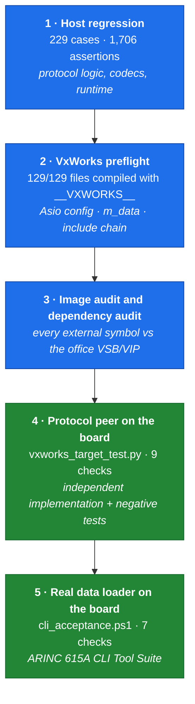

### Layer 1 — Host build and offline verification

Any Linux or WSL machine with a C++17 compiler, CMake 3.24+, Ninja and Python 3.
Nothing is downloaded: Boost is unpacked from the bundled archive and checked
against its SHA-256.

```bash
cmake -S . -B build -G Ninja -DARINC_BUILD_TESTS=ON -DCMAKE_BUILD_TYPE=Debug
cmake --build build
ctest --test-dir build --output-on-failure
```

```text
1/3 Test #2: arinc_self_test ..................   Passed
2/3 Test #1: arinc_regression .................   Passed
3/3 Test #3: arinc_network_transfers ..........   Passed
100% tests passed, 0 tests failed out of 3
```

`arinc_regression` runs 229 test cases with 1,706 assertions (see
`build/Testing/Temporary/LastTest.log`).

### Layer 2 — VxWorks preflight

Compiles every production file with `__VXWORKS__` and `_WRS_KERNEL` defined,
against stub SDK headers. The stub `sockLib.h` defines the real `m_data` macro, so
a missing fix fails here, not in the office.

```bash
cmake --build build --target arinc_vxworks_preflight
```

```text
VxWorks-branch syntax check: 129/129 clean
Boost platform profile: VxWorks 7
Boost.Asio reactor:     select
Asio local sockets:     disabled
Asio interrupter:       socket
Asio include chain, VxWorks (__VXWORKS__)  -> selectLib_h
VxWorks preflight passed.
```

### Layer 3 — Dependency audit

```bash
cmake --build build --target arinc_target_audit
```

Checks that no excluded library (Qt, Helper, program_options, ARINC 649 and so
on) leaks into the target archives, and records every header dependency.

### Layer 4 — Protocol peer against the board

[`tests/vxworks_target_test.py`](tests/vxworks_target_test.py) is an independent
UDP/TFTP peer written against the standard, not against this code. It uses only
the Python standard library. With `tArinc` running (see [Runtime](#runtime--load-and-run-on-the-board)):

```bat
ping 192.168.0.3
python tests\vxworks_target_test.py --target 192.168.0.3
```

| ID | Check |
| --- | --- |
| T01 | FIND answered with hardware ID `ARINC` |
| T02 | Information: `LCL` has `DEMO-PN`/`TEST001`; one DATA packet is **dropped on purpose** and must be retransmitted |
| T03 | Operator Defined Download: listing, selection, 4097-byte payload byte-identical |
| T04 | Media Defined Download: payload byte-identical, completed status |
| T05 | Upload: ARINC 665 header + payload, completed |
| T06 | Malformed FIND ignored; the next FIND is answered |
| T07 | Empty, malformed and **path-traversal** load headers rejected (`0x1003`); target keeps serving |
| T08 | Corrupt and truncated payloads rejected; the next valid upload succeeds |
| T09 | `--soak N`: N upload + download cycles, for memory checks with `memShow` |

```text
PASS: T01 FIND answered by 192.168.0.3
PASS: T02 Information: LCL has DEMO-PN/TEST001 (one lost DATA packet retransmitted)
…
ALL 9 CHECKS PASSED in 7.5 s. Now run on the target: arinc615aVerifyTestUpload "<root>"
```

Then, on the board:

```c
-> arinc615aVerifyTestUpload "/sd0a/arinc_test"
ARINC upload check PASS (payload byte-identical, no path-traversal file)
```

Options: `--find-port`, `--tftp-port`, `--target-id`, `--thw-id`, `--serial`,
`--timeout`, `--soak N`, `--bind <PC-IP>`.

### Layer 5 — Data loader CLI acceptance

The decisive test: the **real data loader**, `arinc_615a_operation.exe` from the
[ARINC 615A CLI Tool Suite](https://github.com/Hitheshkaranth/arinc-615a-cli-tool-suite),
against the target. [`tests/cli_acceptance.ps1`](tests/cli_acceptance.ps1) runs
every operation and builds an ARINC 665 media set for the upload.

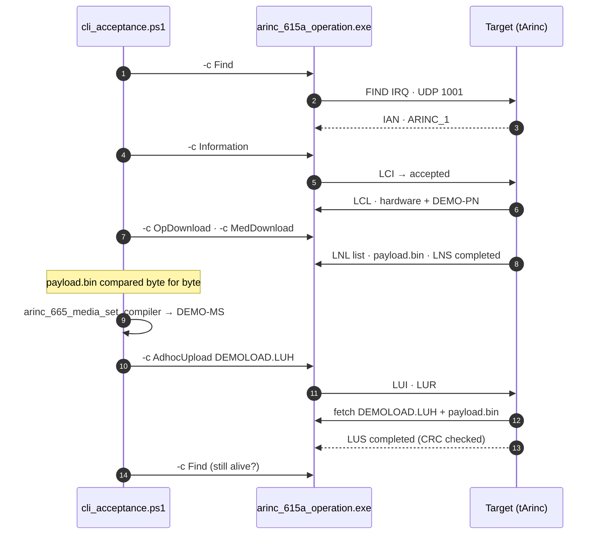

#### One-time CLI setup

> [!WARNING]
> **Apply the exit-hang patch first.** In the published CLI suite, the command
> registry is declared before the `io_context`, so it is destroyed after it. That
> is undefined behaviour. A clean A/B test on the MSVC **debug** build (same build
> tree, a fresh target for every run, the operation confirmed complete on the wire
> each time) gave: **unpatched, 5 of 5 runs hung at exit** with no result printed;
> **patched, 0 of 5 hung** and all 5 printed `Operation completed`. The unpatched
> **release** build exited normally in 5 of 5 runs, but the destruction order is
> still wrong. The one-line reorder is in
> [`tests/cli/arinc_615a_operation-exit-hang.patch`](tests/cli/arinc_615a_operation-exit-hang.patch).

```bat
cd <cli-suite>
git apply <this-repo>\tests\cli\arinc_615a_operation-exit-hang.patch
build.bat --no-run
cmake --build <cli-build> --target arinc_665_media_set_compiler
```

Let the CLI receive UDP from the board. Run this once, in an elevated `cmd`:

```bat
netsh advfirewall firewall add rule name="ARINC615A loader CLI (UDP in)" dir=in action=allow protocol=UDP profile=private program="<cli-build>\app\arinc_615a_operation\arinc_615a_operation.exe"
```

#### Run

```bat
powershell -ExecutionPolicy Bypass -File tests\cli_acceptance.ps1 -Target 192.168.0.3 -CliBuild <cli-build>
```

Expected output:

```text
PASS: C01 FIND answered by 192.168.0.3 with target ID ARINC_1
PASS: C02 Information: integrity valid, part number DEMO-PN, completed
PASS: C03 Operator Defined Download: file list received, payload.bin byte-identical, completed
PASS: C04 Media Defined Download: payload.bin byte-identical, completed
PASS: C05 ARINC 665 media set DEMO-MS compiled
PASS: C06 Adhoc Upload of DEMOLOAD.LUH (DEMO-PN): load and operation completed
PASS: C07 Target still answers FIND after all operations

7 passed, 0 failed.
```

Finish with `arinc615aVerifyTestUpload "/sd0a/arinc_test"` on the board.

#### How it was actually tested, and the result

The target has been run against the CLI Tool Suite's `arinc_615a_operation.exe`,
but **not yet on the board**. The target application ran on the same PC in WSL:

| | Used in the test run |
| --- | --- |
| Data loader | `arinc_615a_operation.exe`, MSVC 2022 debug build from the local ARINC-EXAMPLE tree. This is the same `arinc_615a_operation` source the [CLI Tool Suite](https://github.com/Hitheshkaranth/arinc-615a-cli-tool-suite) publishes (the patch applies unchanged to both), **with the exit-hang patch** applied |
| Target | `arinc_host_runner` from the freshly unzipped handoff, built with the VxWorks wake-up path (`-DARINC_ASIO_SOCKET_SELECT_INTERRUPTER=1`), running the same `arinc615aPrepareTest` + `arinc615aRun` code as the DKM |
| Network | Windows 11 → WSL 2 Ubuntu, target at `172.20.60.83`, FIND port `11001`, TFTP port `10059` (Linux needs root for ports below 1024) |
| Firewall | Rule letting the CLI receive UDP from the WSL range |

The steps, exactly as run:

```bash
# 1. WSL: start the target
./build_sock/arinc_host_runner --prepare /tmp/arinc_cli
sed -i 's/"port": 59,/"port": 10059,/; s/"find_port": 1001/"find_port": 11001/' /tmp/arinc_cli/test-config.json
./build_sock/arinc_host_runner /tmp/arinc_cli/test-config.json
```

```bat
REM 2. Windows: run the loader against it
powershell -ExecutionPolicy Bypass -File tests\cli_acceptance.ps1 -Target 172.20.60.83 -CliBuild <cli-build> -FindPort 11001 -TftpPort 10059
```

```bash
# 3. WSL: check what the target stored
./build_sock/arinc_host_runner --verify /tmp/arinc_cli
```

The result:

```text
PASS: C01 FIND answered by 172.20.60.83 with target ID ARINC_1
PASS: C02 Information: integrity valid, part number DEMO-PN, completed
PASS: C03 Operator Defined Download: file list received, payload.bin byte-identical, completed
PASS: C04 Media Defined Download: payload.bin byte-identical, completed
PASS: C05 ARINC 665 media set DEMO-MS compiled
PASS: C06 Adhoc Upload of DEMOLOAD.LUH (DEMO-PN): load and operation completed
PASS: C07 Target still answers FIND after all operations

7 passed, 0 failed.

ARINC upload check PASS (payload byte-identical, no path-traversal file)
```

What the CLI reported for each operation (abridged):

```text
-c Find          Response from 172.20.60.83: THW ID 'ARINC' · THW Type Name 'THA' · ** Target ID ** 'ARINC_1'
-c Information   Initialisation Code: Operation Accepted (0001) · Information Integrity: Valid
                 Literal Name 'ARINC 615A Test' · Serial Number 'TEST001' · Part Number 'DEMO-PN'
                 Final Status Code: Operation completed (0003)
-c OpDownload    Received File List: demo.LUH 104 · empty.LUH 62 · payload.bin 4097 · traversal.LUH 106
                 payload.bin 0003 · demo.LUH 0003 · Final Status Code: Operation completed (0003)
-c MedDownload   payload.bin: Transfer OK · 4097 bytes · Final Status Code: Operation completed (0003)
-c AdhocUpload   DEMOLOAD.LUH · Part Number 'DEMO-PN' · Ratio 100% · Final Status Code: Operation completed (0003)
```

The same run with the unpatched CLI finished every operation on the wire, then
hung at exit without printing a result. That is how the exit-hang bug was found.

#### Running the CLI by hand

```bat
set PATH=C:\vi\x64-windows\bin;%PATH%      REM suite scripts; for a debug build use C:\vi\x64-windows\debug\bin
arinc_615a_operation.exe -c Find        --target-address=192.168.0.3
arinc_615a_operation.exe -c Information --target-address=192.168.0.3 --target-id=ARINC_1 --port-option
arinc_615a_operation.exe -c OpDownload  --target-address=192.168.0.3 --target-id=ARINC_1 --port-option --file=payload.bin
```

> [!TIP]
> Always use `--option=value`. Several short options clash (`-l`, `-t`), and
> `--target-address` followed by a space swallows the next argument. A missing
> DLL shows up as exit code `0xC0000135`; put the vcpkg `bin` folder on `PATH`.
> `cli_acceptance.ps1` does this itself. It finds `C:\vi` or `<cli-build>\vcpkg_installed`
> and picks debug or release DLLs from the exe's imports; override with `-VcpkgInstalled`.

### Lifecycle and resource checks

```c
-> arinc615aStop                  /* then restart 3 times; each cycle must pass layer 4 */
-> taskSpawn("tArinc2", …)        /* a second runtime must be rejected */
-> checkStack "tArinc"            /* high-water mark well below 1 MiB, no OVERFLOW */
-> memShow                        /* before and after --soak 50: no downward trend */
```

Every step, with expected results and a results sheet to fill in, is in
[`workbench/VXWORKS_TEST_PROCEDURE.md`](workbench/VXWORKS_TEST_PROCEDURE.md).
Call the port board-validated only when all of its rows pass.

---

## Rehearse without a board

The same entry points build into a host program, `arinc_host_runner`, so the
whole procedure can run on a PC (Linux or WSL) before any board time. Ports
below 1024 need root on Linux, so the rehearsal moves them:

```bash
./build/arinc_host_runner --prepare /tmp/arinc
sed -i 's/"port": 59,/"port": 10059,/; s/"find_port": 1001/"find_port": 11001/' /tmp/arinc/test-config.json
./build/arinc_host_runner /tmp/arinc/test-config.json        # Enter stops it
```

From Windows, against the WSL IP (`wsl hostname -I`):

```bat
python tests\vxworks_target_test.py --target <wsl-ip> --find-port 11001 --tftp-port 10059 --soak 20
powershell -ExecutionPolicy Bypass -File tests\cli_acceptance.ps1 -Target <wsl-ip> -CliBuild <cli-build> -FindPort 11001 -TftpPort 10059
```

To test the **VxWorks code path** on the host, add
`-DCMAKE_CXX_FLAGS=-DARINC_ASIO_SOCKET_SELECT_INTERRUPTER=1` to the CMake configure.

> A rehearsal pass proves the procedure and the protocol, not VxWorks. The board
> run is still required.

---

## Test results

Latest run: 25–26 September 2026, on `main`.

| Layer | Environment | Result |
| --- | --- | --- |
| Host regression | WSL Ubuntu · GCC 15.2 · CMake 4.2 | ✅ 229/229 cases · 1,706 assertions |
| Package self-test + network suite | Fresh unzip of the handoff, normal and VxWorks-path builds | ✅ 2/2 · 2/2 |
| VxWorks preflight | `__VXWORKS__` + stub SDK | ✅ 129/129 · socket interrupter · `selectLib.h` |
| Dependency audit | `arinc_target_audit` | ✅ passed |
| Unresolvable-on-image symbols | VxWorks-path build vs office image | ✅ none (`pipe`, `eventfd`, `socketpair`, `pthread_rwlock` all gone) |
| Protocol peer | Windows Python → target in WSL | ✅ 9/9 including 20-cycle soak |
| **Real data loader** | **ARINC 615A CLI Tool Suite (MSVC) → target in WSL** | ✅ **7/7** · upload verified on target |
| CLI exit-hang patch, A/B | MSVC debug CLI, fresh target per run | ✅ unpatched 5/5 hung · patched 0/5 hung, 5/5 results |
| One-line install | Bare Ubuntu 24.04/22.04, Debian 12, Fedora 41, Arch, openSUSE · WSL · Windows | ✅ all passed, cloned from GitHub |
| Workbench DKM build | Office SDK | ⏳ pending, in the office |
| Board run (layers 4 and 5) | LS1028A board | ⏳ pending, in the office |

---

## Troubleshooting

| Symptom | Cause and fix |
| --- | --- |
| `Select a VxWorks Downloadable Kernel Module project` | The project is an RTP. Recreate it as a DKM |
| `sys/poll.h` not found | The bundled Asio overlay was overwritten. Restore `include/boost/asio/detail/` from the package |
| Unresolved `pipe` at `ld` | The interrupter patch is missing: check `BuildConfig.hpp` and `select_interrupter.hpp` (or add `INCLUDE_POSIX_PIPES` to the image) |
| `<filesystem>` not found | The VSB lacks C++17 filesystem support; this is a platform configuration item |
| FIND times out | Wrong IP or subnet (`ping` first), PC firewall, `tArinc` not running (`i`), or UDP 1001 already in use |
| FIND works, transfers time out | The PC firewall is dropping the board's TFTP transfers back to the loader. Add the firewall rule, or use `--bind <PC-IP>` on a multi-homed PC |
| Valid upload rejected with `0x1003` | The upload folder is not writable. Check `devs`, `ls "/sd0a/arinc_test/upload"` and free space |
| `tArinc` is `SUSPEND` | It crashed. Check `checkStack` and `tt tArinc`; raise the stack to `0x200000` and keep `VX_FP_TASK` |
| CLI never exits | Apply `tests/cli/arinc_615a_operation-exit-hang.patch` to the CLI suite |
| CLI exits with `0xC0000135` | vcpkg DLLs are not on `PATH` |

---

## Repository layout

```
.
├── workbench/                     Workbench-facing sources and docs
│   ├── EntryPoints.cpp/.h         arinc615aSelfTest · Demo · Run · Stop
│   ├── TestSupport.cpp            arinc615aPrepareTest · VerifyTestUpload · WriteFixtures
│   ├── START_HERE.md              office build guide
│   ├── VXWORKS_TEST_PROCEDURE.md  board acceptance procedure + results sheet
│   ├── BUILD_OPTIONS.txt          compiler flags and include paths for the DKM
│   └── target-config.json         sample runtime configuration
├── lib/
│   ├── arinc_615a/                protocol library (target, find, files, tftp options)
│   ├── tftp/                      TFTP client/server
│   ├── arinc_checksum/            CRC and hash check values
│   └── arinc_support/             BuildConfig.hpp · BoostVxWorks.hpp · utilities
├── app/arinc_615a_unit_test/arinc_615a_test_tha/   THA application (JSON → operations)
├── third_party/
│   ├── arinc_665/                 ARINC 665 load format (bundled)
│   ├── boost_1_88_0_headers.tar.gz   Boost, SHA-256 verified, unpacked offline
│   └── boost_vxworks_overlay/     VxWorks fixes to Boost.Asio (poll · socketpair · m_data)
├── tests/
│   ├── vxworks_target_test.py     layer 4 · protocol peer · 9 checks
│   ├── cli_acceptance.ps1         layer 5 · data loader CLI · 7 checks
│   ├── cli/                       exit-hang patch for the CLI suite
│   ├── vxworks_preflight/         layer 2 · VxWorks-branch compile check
│   └── network_smoke.py …         layer 1 · host suites
├── tools/prepare_office.py        builds the Workbench handoff package
├── delivery/ARINC615A_OFFICE_READY.zip   ready-to-build handoff for the office
├── VALIDATION.md                  what has been proven, and how
└── docs/UPSTREAM_README.md        original upstream README (desktop suite)
```

### Regenerating the handoff

```bash
mkdir -p /tmp/src && git -c core.autocrlf=false archive HEAD | tar -x -C /tmp/src && cd /tmp/src
cmake -S . -B build -G Ninja -DARINC_BUILD_TESTS=ON && cmake --build build
python3 tools/prepare_office.py --build build --source-commit "$(git -C <repo> rev-parse HEAD)" \
  --output /tmp/pkg/ARINC615A_OFFICE_READY
```

The generator refuses to overwrite, writes `SHA256SUMS.txt` and `BUILD_INFO.txt`,
and zips the result. Use the `archive` step with `core.autocrlf=false`, or Windows
line endings leak into every file.

---

## Documentation

| Document | What's in it |
| --- | --- |
| **[workbench/START_HERE.md](workbench/START_HERE.md)** | **Start here in the office.** Workbench project setup, build options, first-build troubleshooting, runtime and acceptance checklist |
| **[workbench/VXWORKS_TEST_PROCEDURE.md](workbench/VXWORKS_TEST_PROCEDURE.md)** | Phases A–I on the board, with exact commands, expected output, troubleshooting and a results sheet |
| **[VALIDATION.md](VALIDATION.md)** | What has been verified, on what, and what is still open |
| **[tests/vxworks_preflight/README.md](tests/vxworks_preflight/README.md)** | What the VxWorks preflight checks and why |
| **[third_party/DEPENDENCIES.md](third_party/DEPENDENCIES.md)** | Bundled dependencies and their licences |
| **[VxWorksDKM.md](VxWorksDKM.md)** | Alternative static-library cross-build |
| **[docs/UPSTREAM_README.md](docs/UPSTREAM_README.md)** | The original upstream README for the desktop suite |

**Related:** [ARINC 615A CLI Tool Suite](https://github.com/Hitheshkaranth/arinc-615a-cli-tool-suite)
(the data loader used to test this target) ·
[ARINC 615A GUI Tool Suite](https://github.com/Hitheshkaranth/arinc-615a-gui-tool-suite)

---

## Protocol background

The library implements **ARINC 615A Supplements 2, 3 and 4**. The target
announces its protocol version, and the loader adapts to it.

| Supplement | Notable changes |
| --- | --- |
| **615A-1** | Uppercase protocol filenames · UDP port 59 · block-size option mandatory for the host · exception timer in status files |
| **615A-2** | SNIP renamed **FIND** and made optional · protocol version `A3` · `LCL` gains multiple target hardware and part-number amendments |
| **615A-3** | Transfer-size and timeout options optional · **checksum** and **port** options · status `0004` |
| **615A-4** | Part-number option corrected · checksum option description updated |

**References:** ARINC 615A-4 (Software Data Loader Using Ethernet Interface) ·
ARINC 665-5 (Loadable Software Standards) · ARINC 645-1 (Common Terminology and
Functions for Software Distribution and Loading).

---

## Licence

[](LICENSE)

Mozilla Public License 2.0. Based on the ARINC 615A Tool Suite © Thomas Vogt,
<https://git.thomas-vogt.de/thomas-vogt/arinc_615a>. The MPL requires this licence
and its attribution to be kept in redistributions. Bundled Boost is under the
Boost Software License 1.0; see [`third_party_licenses/`](third_party_licenses).

ARINC® is a trademark of its respective owner. This project implements the
publicly documented ARINC 615A protocol and is **not affiliated with, endorsed
by, or a product of ARINC**. The ARINC standards themselves are not
redistributed here.

VxWorks® and Wind River® are trademarks of Wind River Systems, Inc. The VxWorks
wordmark in the banner is a plain typographic rendering that only identifies the
target platform. This project is not affiliated with or endorsed by Wind River,
and contains no Wind River SDK code.
